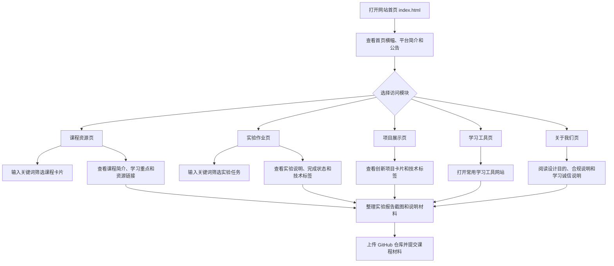

# 业务流程说明

## 业务流程概述

信息学院学生学习导航平台的业务流程以“进入网站、选择学习模块、浏览或筛选内容、查看详细入口、整理项目材料”为主线。用户进入首页后，可以通过导航栏或首页功能入口进入不同模块。课程资源页和实验作业页支持关键词搜索，帮助用户快速定位目标内容。项目展示页用于查看项目案例，学习工具页用于访问常用工具，关于我们页用于了解项目说明和合规要求。

## 用户访问流程

1. 用户打开 `index.html` 进入首页。
2. 用户查看首页横幅、平台简介和公告信息。
3. 用户通过导航栏或功能入口选择目标页面。
4. 如果进入课程资源页或实验作业页，可输入关键词筛选卡片。
5. 用户浏览课程、实验、项目或工具卡片。
6. 用户根据按钮进入对应资源或查看项目说明。
7. 用户返回顶部或继续切换页面。
8. 在报告整理阶段，根据截图清单完成页面截图和仓库截图。

## Mermaid 业务流程图代码

## 前端交互流程

导航高亮流程：页面加载后，JavaScript 获取当前页面文件名，与导航链接地址进行比较，将匹配的导航项添加 `active` 样式。

搜索筛选流程：用户在搜索框输入关键词，JavaScript 获取所有目标卡片的文本内容和关键词属性，判断是否包含搜索词，符合条件的卡片显示，不符合条件的卡片隐藏，并更新显示数量。

公告切换流程：首页公告区域包含多个公告项和圆点按钮。页面加载后默认显示第一条公告，用户点击圆点可以切换公告，系统也会按时间间隔自动轮播。

返回顶部流程：页面滚动超过一定距离后显示返回顶部按钮，点击按钮后平滑滚动到页面顶部。
